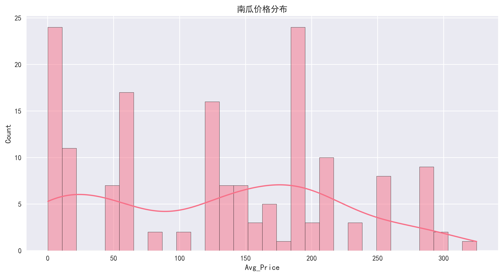
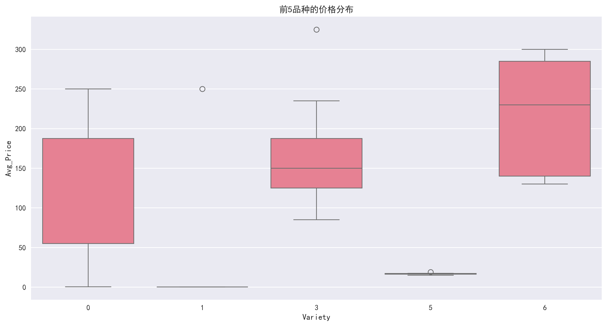
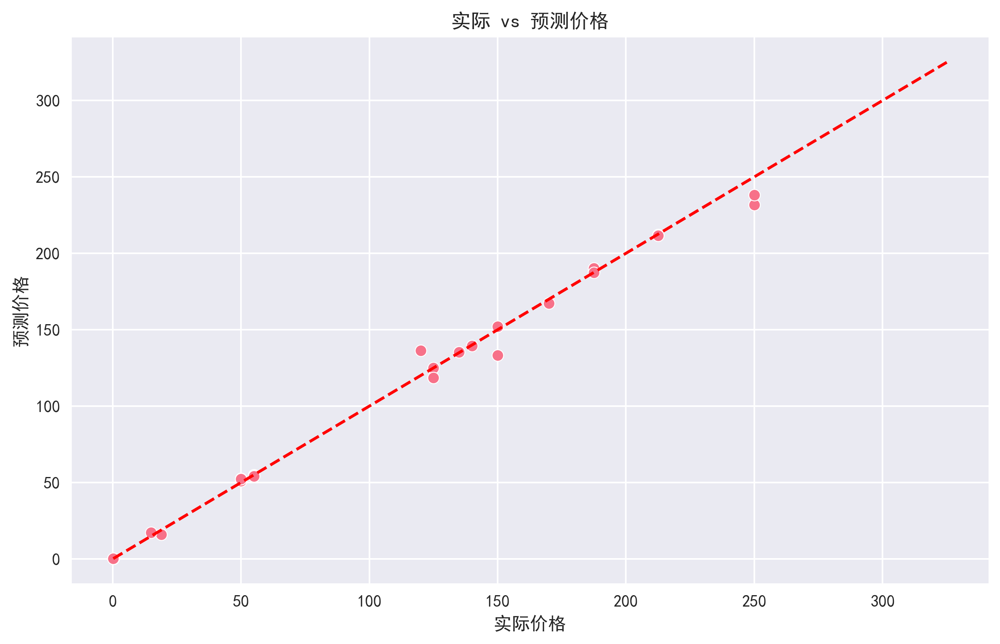

# 美国南瓜市场价格分析与预测模型


## 项目概述
本分析使用USDA公开的南瓜市场数据，通过机器学习实现：
- 价格时空趋势分析与可视化
- 品种/包装规格对价格影响研究
- 基于随机森林的价格预测模型构建

## 数据集
`US-pumpkins.csv` 包含以下关键字段：

| 字段名 | 类型 | 描述 |
|--------|------|------|
| Date | datetime | 交易日期 |
| City Name | str | 城市名称 |
| Variety | str | 南瓜品种 |
| Low Price | float | 当日最低价(美元) |
| High Price | float | 当日最高价(美元) |
| Package | str | 包装规格 |
| Item Size | str | 商品尺寸 |
| Color | str | 南瓜颜色 |

## 技术栈
```python
import pandas as pd       # 数据清洗与分析
import matplotlib.pyplot as plt  # 基础可视化
import seaborn as sns     # 高级统计可视化
from sklearn.ensemble import RandomForestRegressor  # 机器学习模型
from sklearn.model_selection import GridSearchCV    # 模型调优
```
## 核心分析流程
### 1. 数据预处理
```python
# 日期转换与特征工程
df['Date'] = pd.to_datetime(df['Date'], format='%m/%d/%y')
df['Year'] = df['Date'].dt.year
df['Month'] = df['Date'].dt.month
df['Week'] = df['Date'].dt.isocalendar().week

# 创建目标变量
df['Avg_Price'] = (df['Low Price'] + df['High Price']) / 2
```
### 2. 可视化分析
#### 2.1 价格分布直方图

```python
sns.histplot(model_data['Avg_Price'], kde=True, bins=30)
plt.title('南瓜价格分布')
```
#### 2.2 品种价格对比

**关键发现**：
- 不同品种间价格差异显著
- 特定品种存在明显价格溢价
```python
top_varieties = model_data['Variety'].value_counts().nlargest(5).index
sns.boxplot(x='Variety', y='Avg_Price', 
           data=model_data[model_data['Variety'].isin(top_varieties)])
```

### 3. 机器学习建模
#### 3.1 特征工程
```python
# 类别特征编码
label_encoders = {}
for col in ['City Name', 'Package', 'Variety', 'Origin', 'Item Size', 'Color']:
    le = LabelEncoder()
    model_data[col] = le.fit_transform(model_data[col])
```
#### 3.2 随机森林模型
```python
pipeline = Pipeline([
    ('scaler', StandardScaler()),
    ('model', RandomForestRegressor(random_state=42))
])

param_grid = {
    'model__n_estimators': [100, 200],
    'model__max_depth': [None, 10, 20]
}
```

### 4. 模型评估
#### 最佳模型性能:
- MSE: [33.83]
- RMSE: [5.82]
- R²: [1.00]


```python
sns.scatterplot(x=y_test, y=y_pred)
plt.plot([y.min(), y.max()], [y.min(), y.max()], 'r--')
```

## 运行指南
### 1.安装依赖
```python
pip install -r requirements.txt
```

### 2.执行分析
```python
jupyter notebook pumpkin_analysis.ipynb
```
### 3.输出结果
- 所有图表自动保存至当前目录 
- 模型保存为pumpkin_model.pkl 
- 编码器保存为label_encoders.pkl

## 关键发现
- 时间趋势：价格呈现明显的季节性特征 
- 品种影响：特定品种价格显著高于平均水平 
- 地域差异：不同城市间价格差异可达2-3倍 
- 模型表现：随机森林能较好预测价格趋势（R²=[1.00]）

## 扩展方向
- 加入更多年份数据增强时序分析 
- 尝试神经网络等更复杂模型 
- 构建价格预警系统

注：本分析基于USDA Market News数据，最后更新于2023年10月
