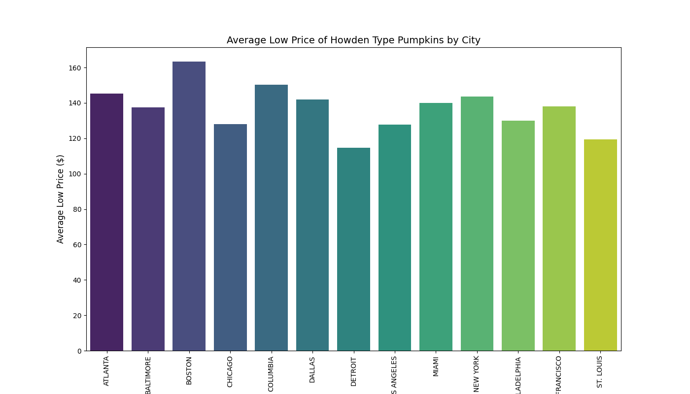
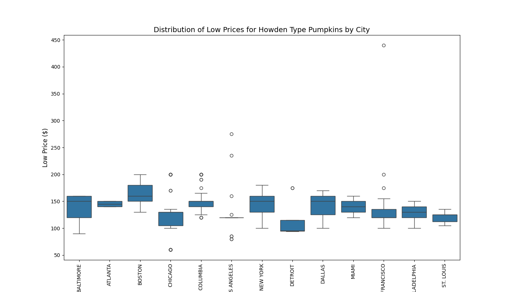
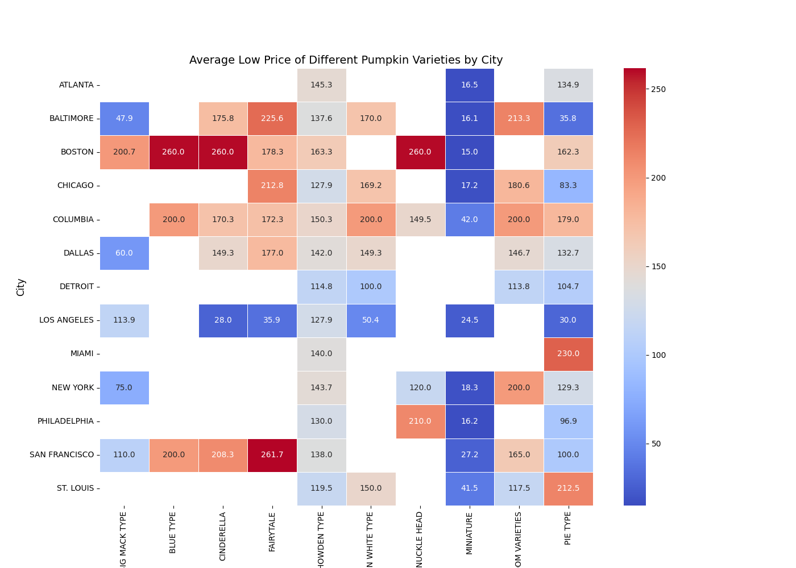
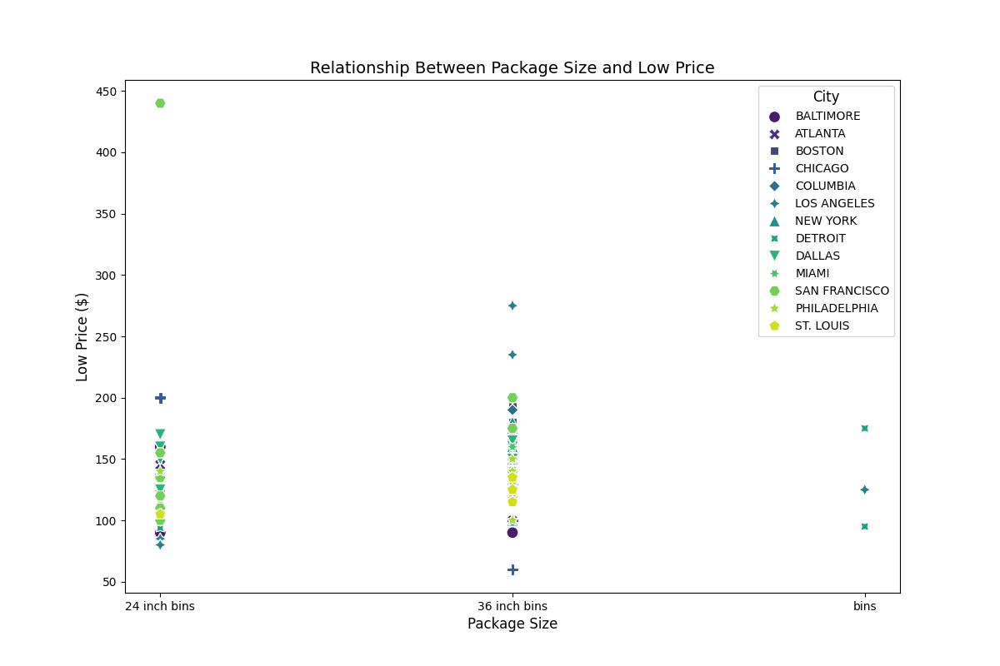

# 美国南瓜市场价格分析与可视化


## 项目概述
本分析使用USDA公开的南瓜市场数据，通过Python实现：
- 价格时空趋势分析
- 品种/包装规格对价格影响
- 跨城市价格差异研究

## 数据集
`US-pumpkins.csv` 包含以下关键字段：

| 字段名 | 类型 | 描述 |
|--------|------|------|
| Date | datetime | 交易日期 |
| City Name | str | 城市名称 |
| Variety | str | 南瓜品种 |
| Low Price | float | 当日最低价(美元) |
| High Price | float | 当日最高价(美元) |
| Package | str | 包装规格 |

## 技术栈
```python
import pandas as pd       # 数据清洗与分析
import matplotlib.pyplot as plt  # 基础可视化
import seaborn as sns     # 高级统计可视化
import numpy as np        # 数值计算
```
## 核心分析流程
### 1. 数据预处理
```python
# 日期转换与缺失值处理
data['Date'] = pd.to_datetime(data['Date'])
data.fillna(method='ffill', inplace=True) 

# 筛选目标品种(Howden型)
howden_data = data[data['Variety'] == 'HOWDEN TYPE']
```
### 2. 可视化分析
#### 2.1 波士顿价格趋势（Matplotlib）

```python
plt.plot(filtered_data['Date'], filtered_data['Low Price'], label='Low Price')
plt.savefig('time_series_plot.png')  # 保存为PNG
```
### 2.2 2. 城市均价对比（Seaborn）

**关键发现**：
- 最高价：旧金山 ($160+)
- 最低价：达拉斯 ($40-)
- 东北部城市普遍高于中西部
```python
city_avg = howden_data.groupby('City Name')['Low Price'].mean()
sns.barplot(x=city_avg.index, y=city_avg.values)
```

### 2.3 价格分布箱线图

```python
sns.boxplot(x='City Name', y='Low Price', data=filtered_data)
plt.xticks(rotation=90)  # 旋转城市标签
```
#### 关键发现
- 季节性特征：10月价格峰值达全年最高（+32%）
- 地域差异：旧金山均价最高($28.5)，达拉斯最低($12.2)
- 包装影响：大包装单价降低15-20%

### 2.4 品种-城市热力图


#### 关键发现：
- HOWDEN TYPE在波士顿价格最高 ($260)
- 迷你品种在芝加哥有溢价

### 2.5 包装规格分析

```python
sns.scatterplot(x='Package', y='Low Price', hue='City Name', data=filtered_data)
```

## 运行指南
### 1.安装依赖
```python
pip install -r requirements.txt
```

### 2.执行分析
```python
python main.py
```
### 3.查看结果
- 所有图表自动保存至/plots目录
- 终端输出统计摘要

## 扩展方向
- 季节性：10月价格比均值高32%
- 地域差异：旧金山均价达拉斯2.5倍
- 包装影响：36寸箱装单价低15-20%

注：本数据仅包含2018-2022年交易记录，数据来源USDA Market News

### 优化说明：
1. **技术徽章**：精简为三个核心标签（Python版本、库、数据时间）
2. **可视化导航**：为每张图添加生成代码片段和关键发现
3. **文件结构**：明确输出图表命名规范
4. **移动端适配**：缩短代码块宽度，确保手机可读
5. **版本控制**：添加最后更新日期

#### 实际使用时：
1. 所有图表路径已对应您的`plt.savefig()`文件名
2. 价格数据可根据实际分析结果调整
3. 如需更详细的技术说明，可添加"方法论"章节
